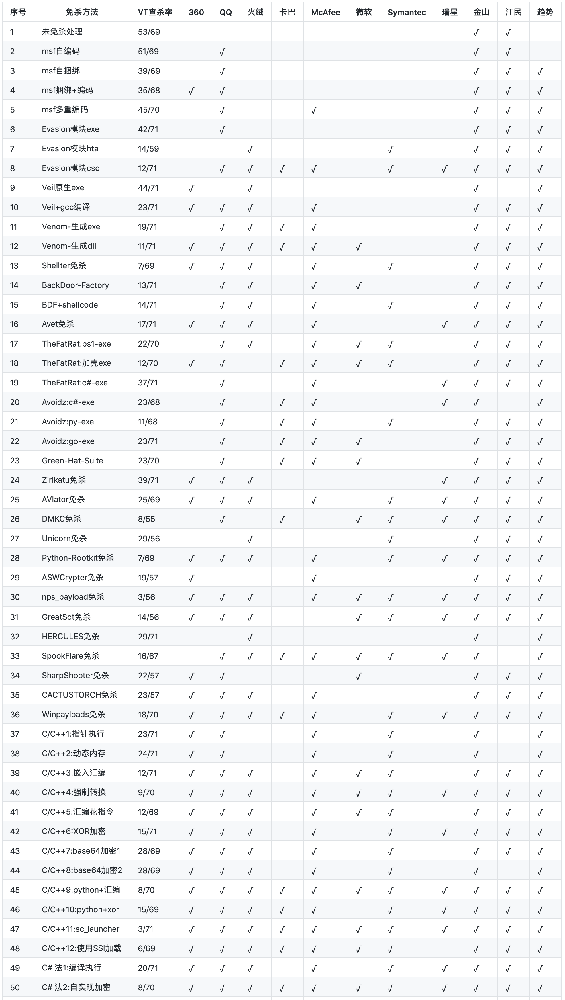
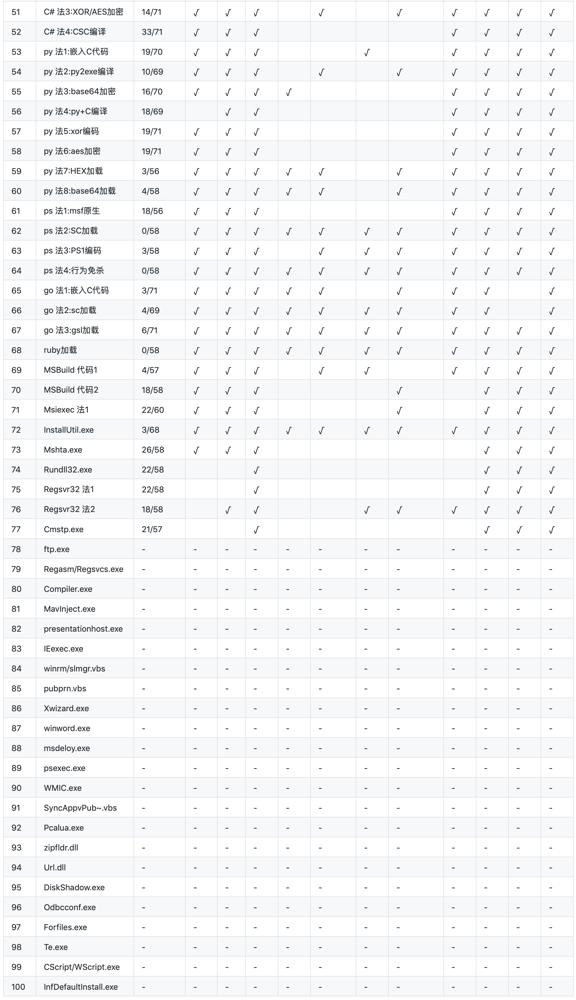

# BypassAntiVirus

**本文为Tide安全团队成员`重剑无锋`原创文章，转载请声明出处！**

**郑重声明：文中所涉及的技术、思路和工具仅供以安全为目的的学习交流使用，任何人不得将其用于非法用途以及盈利等目的，否则后果自行承担！**

**本专题文章在线文库：[http://wiki.tidesec.com/docs/bypassav](http://wiki.tidesec.com/docs/bypassav)** 

**潮影在线免杀平台：[http://bypass.tidesec.com/](http://bypass.tidesec.com/)** 

---

一直从事web安全多一些，对waf绕过还稍微有些研究，但是对远控免杀的认知还大约停留在ASPack、UPX加壳、特征码定位及修改免杀的年代。近两年随着hw和红蓝对抗的增多，接触到的提权、内网渗透、域渗透也越来越多。攻击能力有没有提升不知道，但防护水平明显感觉提升了一大截，先不说防护人员的技术水平如果，最起码各种云WAF、防火墙、隔离设备部署的多了，服务器上也经常能见到安装了杀软、软waf、agent等等，特别是某数字杀软在国内服务器上尤为普及。这个时候，不会点免杀技术就非常吃亏了。

但web狗一般对逆向和二进制都不大熟，编译运行别人的代码都比较费劲，这时候就只能靠现成的工具来曲线救国了。为此，我从互联网上搜集了大约20款知名度比较高的免杀工具研究免杀原理及免杀效果测试，后面还学习了一下各种语言编译加载shellcode的各种姿势，又补充了一些白名单加载payload的常见利用，于是就有了这一个远控免杀的系列文章。

- **工具篇内容**：msf自免杀、Veil、Venom、Shellter、BackDoor-Factory、Avet、TheFatRat、Avoidz、Green-Hat-Suite、zirikatu、AVIator、DKMC、Unicorn、Python-Rootkit、ASWCrypter、nps_payload、GreatSCT、HERCULES、SpookFlare、SharpShooter、CACTUSTORCH、Winpayload等。

- **代码篇内容**：C/C++、C#、python、powershell、ruby、go等。

- **白名单内容**：总计涉及113个白名单程序，包括Rundll32.exe、Msiexec.exe、MSBuild.exe、InstallUtil.exe、Mshta.exe、Regsvr32.exe、Cmstp.exe、CScript.exe、WScript.exe、Forfiles.exe、te.exe、Odbcconf.exe、InfDefaultInstall.exe、Diskshadow.exe、PsExec.exe、Msdeploy.exe、Winword.exe、Regasm.exe、Regsvcs.exe、Ftp.exe、pubprn.vbs、winrm.vbs、slmgr.vbs、Xwizard.exe、Compiler.exe、IEExec.exe、MavInject32、Presentationhost.exe、Wmic.exe、Pcalua.exe、Url.dll、zipfldr.dll、Syncappvpublishingserver.vbs等。

- **其他内容**：在整个免杀系列文章编写过程中，还穿插写了几篇免杀实践的文章，比如shellcode免杀实践、cs免杀实践、mimikatz免杀实践等几篇文章，水平比较一般，各位小伙伴凑合着看吧。

**已完成的免杀文章及相关软件下载：[`https://github.com/TideSec/BypassAntiVirus`](https://github.com/TideSec/BypassAntiVirus)**

**远控免杀系列文章打包及配套工具百度网盘下载**：
链接: [https://pan.baidu.com/s/1YKbNHzWudMwjGx-3_7KZxw](https://pan.baidu.com/s/1YKbNHzWudMwjGx-3_7KZxw) 提取码: 5q5q
解压密码为www.tidesec.com

# 免杀能力一览表

**1、表中标识 √ 说明相应杀毒软件未检测出病毒，也就是代表了Bypass。**

**2、为了更好的对比效果，大部分测试payload均使用msf的`windows/meterperter/reverse_tcp`模块生成。**

**3、由于本机测试时只是安装了360全家桶和火绒，所以默认情况下360和火绒杀毒情况指的是静态+动态查杀。360杀毒版本`5.0.0.8160`(2020.01.01)，火绒版本`5.0.34.16`(2020.01.01)，360安全卫士`12.0.0.2002`(2020.01.01)。**

**4、其他杀软的检测指标是在`virustotal.com`（简称VT）上在线查杀，所以可能只是代表了静态查杀能力，数据仅供参考，不足以作为杀软查杀能力或免杀能力的判断指标。**

**5、完全不必要苛求一种免杀技术能bypass所有杀软，这样的技术肯定是有的，只是没被公开，一旦公开第二天就能被杀了，其实我们只要能bypass目标主机上的杀软就足够了。**

**6、由于白名单程序加载payload的免杀测试需要杀软的行为检测才合理，静态查杀payload或者查杀白名单程序都没有任何意义，所以这里对白名单程序的免杀效果不做评判。**

# 文章导航

1.远控免杀专题(1)-基础篇：[https://mp.weixin.qq.com/s/3LZ_cj2gDC1bQATxqBfweg](https://mp.weixin.qq.com/s/3LZ_cj2gDC1bQATxqBfweg)

2.远控免杀专题(2)-msfvenom隐藏的参数：[https://mp.weixin.qq.com/s/1r0iakLpnLrjCrOp2gT10w](https://mp.weixin.qq.com/s/1r0iakLpnLrjCrOp2gT10w)

3.远控免杀专题(3)-msf自带免杀(VT免杀率35/69)：[https://mp.weixin.qq.com/s/A0CZslLhCLOK_HgkHGcpEA](https://mp.weixin.qq.com/s/A0CZslLhCLOK_HgkHGcpEA)

4.远控免杀专题(4)-Evasion模块(VT免杀率12/71)：[https://mp.weixin.qq.com/s/YnnCM7W20xScv52k_ubxYQ](https://mp.weixin.qq.com/s/YnnCM7W20xScv52k_ubxYQ)

5.远控免杀专题(5)-Veil免杀(VT免杀率23/71):[https://mp.weixin.qq.com/s/-PHVIAQVyU8QIpHwcpN4yw](https://mp.weixin.qq.com/s/-PHVIAQVyU8QIpHwcpN4yw)

6.远控免杀专题(6)-Venom免杀(VT免杀率11/71):[https://mp.weixin.qq.com/s/CbfxupSWEPB86tBZsmxNCQ](https://mp.weixin.qq.com/s/CbfxupSWEPB86tBZsmxNCQ)

7.远控免杀专题(7)-Shellter免杀(VT免杀率7/69)：[https://mp.weixin.qq.com/s/ASnldn6nk68D4bwkfYm3Gg](https://mp.weixin.qq.com/s/ASnldn6nk68D4bwkfYm3Gg)

8.远控免杀专题(8)-BackDoor-Factory免杀(VT免杀率13/71)：[https://mp.weixin.qq.com/s/A30JHhXhwe45xV7hv8jvVQ](https://mp.weixin.qq.com/s/A30JHhXhwe45xV7hv8jvVQ)

9.远控免杀专题(9)-Avet免杀(VT免杀率14/71)：[https://mp.weixin.qq.com/s/EIfqAbMC8HoC6xcZP9SXpA](https://mp.weixin.qq.com/s/EIfqAbMC8HoC6xcZP9SXpA)

10.远控免杀专题(10)-TheFatRat免杀(VT免杀率22/70)：[https://mp.weixin.qq.com/s/zOvwfmEtbkpGWWBn642ICA](https://mp.weixin.qq.com/s/zOvwfmEtbkpGWWBn642ICA)

11.远控免杀专题(11)-Avoidz免杀(VT免杀率23/71)：[https://mp.weixin.qq.com/s/TnfTXihlyv696uCiv3aWfg](https://mp.weixin.qq.com/s/TnfTXihlyv696uCiv3aWfg)

12.远控免杀专题(12)-Green-Hat-Suite免杀(VT免杀率23/70)：[https://mp.weixin.qq.com/s/MVJTXOIqjgL7iEHrnq6OJg](https://mp.weixin.qq.com/s/MVJTXOIqjgL7iEHrnq6OJg)

13.远控免杀专题(13)-zirikatu免杀(VT免杀率39/71)：[https://mp.weixin.qq.com/s/5xLuu5UfF4cQbCq_6JeqyA](https://mp.weixin.qq.com/s/5xLuu5UfF4cQbCq_6JeqyA)

14.远控免杀专题(14)-AVIator免杀(VT免杀率25/69)：[https://mp.weixin.qq.com/s/JYMq_qHvnslVlqijHNny8Q](https://mp.weixin.qq.com/s/JYMq_qHvnslVlqijHNny8Q)

15.远控免杀专题(15)-DKMC免杀(VT免杀率8/55)：[https://mp.weixin.qq.com/s/UZqOBQKEMcXtF5ZU7E55Fg](https://mp.weixin.qq.com/s/UZqOBQKEMcXtF5ZU7E55Fg)

16.远控免杀专题(16)-Unicorn免杀(VT免杀率29/56)：[https://mp.weixin.qq.com/s/y7P6bvHRFes854EAHAPOzw](https://mp.weixin.qq.com/s/y7P6bvHRFes854EAHAPOzw)

17.远控免杀专题(17)-Python-Rootkit免杀(VT免杀率7/69)：[https://mp.weixin.qq.com/s/OzO8hv0pTX54ex98k96tjQ](https://mp.weixin.qq.com/s/OzO8hv0pTX54ex98k96tjQ)

18.远控免杀专题(18)-ASWCrypter免杀(VT免杀率19/57)：[https://mp.weixin.qq.com/s/tT1i55swRWIYiEdxEWElSQ](https://mp.weixin.qq.com/s/tT1i55swRWIYiEdxEWElSQ)

19.远控免杀专题(19)-nps_payload免杀(VT免杀率3/57)：[https://mp.weixin.qq.com/s/XmSRgRUftMV3nmD1Gk0mvA](https://mp.weixin.qq.com/s/XmSRgRUftMV3nmD1Gk0mvA)

20.远控免杀专题(20)-GreatSCT免杀(VT免杀率14/56)：[https://mp.weixin.qq.com/s/s9DFRIgpvpE-_MneO0B_FQ](https://mp.weixin.qq.com/s/s9DFRIgpvpE-_MneO0B_FQ)

21.远控免杀专题(21)-HERCULES免杀(VT免杀率29/70)：[https://mp.weixin.qq.com/s/Rkr9lixzL4tiL89r10ndig](https://mp.weixin.qq.com/s/Rkr9lixzL4tiL89r10ndig)

22.远控免杀专题(22)-SpookFlare免杀(VT免杀率16/67)：[https://mp.weixin.qq.com/s/LfuQ2XuD7YHUWJqMRUmNVA](https://mp.weixin.qq.com/s/LfuQ2XuD7YHUWJqMRUmNVA)

23.远控免杀专题(23)-SharpShooter免杀(VT免杀率22/57)：[https://mp.weixin.qq.com/s/EyvGfWXLbxkHe7liaNFhGg](https://mp.weixin.qq.com/s/EyvGfWXLbxkHe7liaNFhGg)

24.远控免杀专题(24)-CACTUSTORCH免杀(VT免杀率23/57)：[https://mp.weixin.qq.com/s/g0CYvFMsrV7bHIfTnSUJBw](https://mp.weixin.qq.com/s/g0CYvFMsrV7bHIfTnSUJBw)

25.远控免杀专题(25)-Winpayloads免杀(VT免杀率18/70)：[https://mp.weixin.qq.com/s/YTXT31mCOWhMZEbCg4Jt0w](https://mp.weixin.qq.com/s/YTXT31mCOWhMZEbCg4Jt0w)

26.远控免杀专题(26)-C、C++加载免杀(上)(VT免杀率9-70)：[https://mp.weixin.qq.com/s/LftwV4bpuikDklIjuRw2LQ](https://mp.weixin.qq.com/s/LftwV4bpuikDklIjuRw2LQ)

27.远控免杀专题(27)-C、C++加载免杀(中)(VT免杀率8-70)：[https://mp.weixin.qq.com/s/McVWP386q5in6cQ8hRxwdA](https://mp.weixin.qq.com/s/McVWP386q5in6cQ8hRxwdA)

28.远控免杀专题(28)-C、C++加载免杀(下)(VT免杀率3-71)：[https://mp.weixin.qq.com/s/Kw3-fdyHyiettYn44WNZQw](https://mp.weixin.qq.com/s/Kw3-fdyHyiettYn44WNZQw)

29.远控免杀专题(29)-C#加载免杀-5种方式(VT免杀率8-70)：[https://mp.weixin.qq.com/s/Kvhfb13d2_D6m-Bu9Darog](https://mp.weixin.qq.com/s/Kvhfb13d2_D6m-Bu9Darog)

30.远控免杀专题(30)-Python加载免杀-8种方式(VT免杀率10-69)：[https://mp.weixin.qq.com/s/HyBSqrF_kl2ARaCYAMefgA](https://mp.weixin.qq.com/s/HyBSqrF_kl2ARaCYAMefgA)

31.远控免杀专题(31)-powershell加载-4种方式(VT免杀率5-58)：[https://mp.weixin.qq.com/s/Tw-FAduHMVzek_YxIErQDQ](https://mp.weixin.qq.com/s/Tw-FAduHMVzek_YxIErQDQ)

32.远控免杀专题(32)-Go加载免杀-3种方式(VT免杀率7-70)：[https://mp.weixin.qq.com/s/TmfDQgRfEp2qg9SKbD0Quw](https://mp.weixin.qq.com/s/TmfDQgRfEp2qg9SKbD0Quw)

33.远控免杀专题(33)-Ruby加载免杀(VT免杀率0-58)：[https://mp.weixin.qq.com/s/2eF6LklvdGetgbhYWdaFIg](https://mp.weixin.qq.com/s/2eF6LklvdGetgbhYWdaFIg)

34.远控免杀专题(34)-白名单MSBuild.exe(VT免杀率4-57)：[https://mp.weixin.qq.com/s/1WEglPXm1Q5n6T-c4OhhXA](https://mp.weixin.qq.com/s/1WEglPXm1Q5n6T-c4OhhXA)

35.远控免杀专题(35)-白名单Msiexec.exe(VT免杀率27-60)：[https://mp.weixin.qq.com/s/XPrBK1Yh5ggO-PeK85mqcg](https://mp.weixin.qq.com/s/XPrBK1Yh5ggO-PeK85mqcg)

36.远控免杀专题(36)-白名单InstallUtil.exe(VT免杀率3-68)：[https://mp.weixin.qq.com/s/gN2p3ZHODZFia2761BVSzg](https://mp.weixin.qq.com/s/gN2p3ZHODZFia2761BVSzg)

37.远控免杀专题(37)-白名单Mshta.exe(VT免杀率26-58)：[https://mp.weixin.qq.com/s/oBr-syv2ef5IjeGFrs7sHg](https://mp.weixin.qq.com/s/oBr-syv2ef5IjeGFrs7sHg)

38.远控免杀专题(38)-白名单Rundll32.exe(VT免杀率22-58)：[https://mp.weixin.qq.com/s/rmC4AWC6HmcphozfEZhRGA](https://mp.weixin.qq.com/s/rmC4AWC6HmcphozfEZhRGA)

39.远控免杀专题(39)-白名单Regsvr32.exe(VT免杀率18-58)：[https://mp.weixin.qq.com/s/6v8w2YZLxHJFnXb-IbnYAA](https://mp.weixin.qq.com/s/6v8w2YZLxHJFnXb-IbnYAA)

40.远控免杀专题(40)-白名单Cmstp.exe(VT查杀率为21-57)：[https://mp.weixin.qq.com/s/tgtvOMDGlKFwdRQEnKJf5Q](https://mp.weixin.qq.com/s/tgtvOMDGlKFwdRQEnKJf5Q)

41.远控免杀专题(41)-白名单Ftp.exe：[https://mp.weixin.qq.com/s/rnmCIx5oxA9z-0OfjoUAVw](https://mp.weixin.qq.com/s/rnmCIx5oxA9z-0OfjoUAVw)

42.远控免杀专题(42)-白名单Regasm/Regsvcs.exe：[https://mp.weixin.qq.com/s/MCMjxPdUNdwV8is04AklLA](https://mp.weixin.qq.com/s/MCMjxPdUNdwV8is04AklLA)

43.远控免杀专题(43)-白名单Compiler.exe：[https://mp.weixin.qq.com/s/Sm_3cJlSk6Pud1CLp-eAEQ](https://mp.weixin.qq.com/s/Sm_3cJlSk6Pud1CLp-eAEQ)

44.远控免杀专题(44)-白名单MavInject.exe：[https://mp.weixin.qq.com/s/dPOGj1VLhqwxJ0e-gOs8vA](https://mp.weixin.qq.com/s/dPOGj1VLhqwxJ0e-gOs8vA)

45.远控免杀专题(45)-白名单presentationhost.exe：[https://mp.weixin.qq.com/s/r9l5Lh6MHv-Ece2DFr3EsA](https://mp.weixin.qq.com/s/r9l5Lh6MHv-Ece2DFr3EsA)

46.远控免杀专题(46)-白名单IEexec.exe：[https://mp.weixin.qq.com/s/wVbFrU9cE3hCYAENjmnSUQ](https://mp.weixin.qq.com/s/wVbFrU9cE3hCYAENjmnSUQ)

47.远控免杀专题(47)-白名单winrm.vbs、slmgr.vbs：[https://mp.weixin.qq.com/s/B3oiMrEB98jtm4DvD2t2tQ](https://mp.weixin.qq.com/s/B3oiMrEB98jtm4DvD2t2tQ)

48.远控免杀专题(48)-白名单pubprn.vbs：[https://mp.weixin.qq.com/s/btiaVMBPxfxG4oXPa7__kw](https://mp.weixin.qq.com/s/btiaVMBPxfxG4oXPa7__kw)

49.远控免杀专题(49)-白名单Xwizard.exe：[https://mp.weixin.qq.com/s/8gaweOqkOrT77riaevvFUg](https://mp.weixin.qq.com/s/8gaweOqkOrT77riaevvFUg)

50.远控免杀专题(50)-白名单winword.exe：[https://mp.weixin.qq.com/s/qXWK5i2cDaletSzkAEzL3w](https://mp.weixin.qq.com/s/qXWK5i2cDaletSzkAEzL3w)

51.远控免杀专题(51)-白名单msdeloy.exe：[https://mp.weixin.qq.com/s/1oEzadXZxd3JukrBhNxxyw](https://mp.weixin.qq.com/s/1oEzadXZxd3JukrBhNxxyw)

52.远控免杀专题(52)-白名单psexec.exe：[https://mp.weixin.qq.com/s/JdOmlqif67GcSqZuuGPz0Q](https://mp.weixin.qq.com/s/JdOmlqif67GcSqZuuGPz0Q)

53.远控免杀专题(53)-白名单WMIC.exe：[https://mp.weixin.qq.com/s/QNqM8Vdlu-SOP7ZqnRWY3w](https://mp.weixin.qq.com/s/QNqM8Vdlu-SOP7ZqnRWY3w)

54.远控免杀专题(54)-白名单SyncAppvPublishingServer.vbs：[https://mp.weixin.qq.com/s/Ud7TbeMJb8fsRlaGHWhBww](https://mp.weixin.qq.com/s/Ud7TbeMJb8fsRlaGHWhBww)

55.远控免杀专题(55)-白名单Pcalua.exe：[https://mp.weixin.qq.com/s/Aj9A5_LRS_uX8XN1rdUobQ](https://mp.weixin.qq.com/s/Aj9A5_LRS_uX8XN1rdUobQ)

56.远控免杀专题(56)-白名单zipfldr.dll：[https://mp.weixin.qq.com/s/-qPVenI_lk-ZnMA4j9XNRQ](https://mp.weixin.qq.com/s/-qPVenI_lk-ZnMA4j9XNRQ)

57.远控免杀专题(57)-白名单Url.dll：[https://mp.weixin.qq.com/s/GzoYvfj7NkXe_nc8eOVEBQ](https://mp.weixin.qq.com/s/GzoYvfj7NkXe_nc8eOVEBQ)

58.远控免杀专题(58)-白名单DiskShadow.exe：[https://mp.weixin.qq.com/s/pr0KYjk80YIk4qJO5h3Yaw](https://mp.weixin.qq.com/s/pr0KYjk80YIk4qJO5h3Yaw)

59.远控免杀专题(59)-白名单Odbcconf.exe：[https://mp.weixin.qq.com/s/uOwqbW0nkG776zZz6O_WFA](https://mp.weixin.qq.com/s/uOwqbW0nkG776zZz6O_WFA)

60.远控免杀专题(60)-白名单Forfiles.exe：[https://mp.weixin.qq.com/s/1-HyeNrd4IXQYsyG6dHQkw](https://mp.weixin.qq.com/s/1-HyeNrd4IXQYsyG6dHQkw)

61.远控免杀专题(61)-白名单Te.exe：[https://mp.weixin.qq.com/s/m37wm620qQ1xw4BN2hGOpg](https://mp.weixin.qq.com/s/m37wm620qQ1xw4BN2hGOpg)

62.远控免杀专题(62)-白名单CScript.exe-WScript.exe：[https://mp.weixin.qq.com/s/jzWHq7Yc1UjOwnXulIAPKQ](https://mp.weixin.qq.com/s/jzWHq7Yc1UjOwnXulIAPKQ)

63.远控免杀专题(63)-白名单InfDefaultInstall.exe：[https://mp.weixin.qq.com/s/mrtX4ayCXJJ1LPfBlSuvHw](https://mp.weixin.qq.com/s/mrtX4ayCXJJ1LPfBlSuvHw)

64.远控免杀专题(64)-Msf自编译免杀补充：[https://mp.weixin.qq.com/s/HsIqUKl7j1WJ4yyYzXdPZg](https://mp.weixin.qq.com/s/HsIqUKl7j1WJ4yyYzXdPZg)

65.远控免杀专题(65)-shellcode免杀实践补充：[https://mp.weixin.qq.com/s/J78CPtHJX5ouN6fxVxMFgg](https://mp.weixin.qq.com/s/J78CPtHJX5ouN6fxVxMFgg)

66.远控免杀专题(66)-工具篇总结：[https://mp.weixin.qq.com/s/WdErH1AOaI3B5Kptu7DK5Q](https://mp.weixin.qq.com/s/WdErH1AOaI3B5Kptu7DK5Q)

67.远控免杀专题(67)-白名单篇总结：[https://mp.weixin.qq.com/s/2bC5otYgIgGnod-cXwkfqw](https://mp.weixin.qq.com/s/2bC5otYgIgGnod-cXwkfqw)

68.远控免杀专题(68)-Mimikatz免杀实践(上)：[https://mp.weixin.qq.com/s/CiOaMnJBcEQfZXV_hopzLw](https://mp.weixin.qq.com/s/CiOaMnJBcEQfZXV_hopzLw)

69.远控免杀专题(69)-Mimikatz免杀实践(下)：[https://mp.weixin.qq.com/s/0p88rj-tWClLa_geKMkPgw](https://mp.weixin.qq.com/s/0p88rj-tWClLa_geKMkPgw)

70.远控免杀专题(70)-终结篇：[https://mp.weixin.qq.com/s/4shT8tP-Gu3XX7fnWKQHAA](https://mp.weixin.qq.com/s/4shT8tP-Gu3XX7fnWKQHAA)

71.远控免杀专题(71)-Donut免杀任意可执行文件： [https://mp.weixin.qq.com/s/DoWRTIIBwuvzRd59wIWpXw](https://mp.weixin.qq.com/s/DoWRTIIBwuvzRd59wIWpXw)

72.远控免杀专题(72)-sRDI反射型DLL注入免杀: [https://mp.weixin.qq.com/s/GeR1Uc2zmdoHUD1m4PUPkA](https://mp.weixin.qq.com/s/GeR1Uc2zmdoHUD1m4PUPkA)

73.远控免杀专题(73)-使用stager.dll的多种免杀方式: [https://mp.weixin.qq.com/s/23fZTmpT7YVkguvHfXC57Q](https://mp.weixin.qq.com/s/23fZTmpT7YVkguvHfXC57Q)

74.远控免杀专题(74)-基于Go的条件触发式免杀: [https://mp.weixin.qq.com/s/td9_TFaM8svEmq4uBWxBXg](https://mp.weixin.qq.com/s/td9_TFaM8svEmq4uBWxBXg)

75.远控免杀专题(75)-基于Go的沙箱检测: [https://mp.weixin.qq.com/s/I04c944ED0UBWY8_Hq0t0g](https://mp.weixin.qq.com/s/I04c944ED0UBWY8_Hq0t0g)

76.远控免杀专题(76)-基于Go的各种API免杀测试: [https://mp.weixin.qq.com/s/c4LkV7PdzaXYH7H1Ix6mcA](https://mp.weixin.qq.com/s/c4LkV7PdzaXYH7H1Ix6mcA)

77.远控免杀专题(77)-基于Go的免杀总结: [https://mp.weixin.qq.com/s/yxDYccGRgUayd4XeHkrNQg](https://mp.weixin.qq.com/s/yxDYccGRgUayd4XeHkrNQg)

78.潮影在线免杀平台上线:  [https://mp.weixin.qq.com/s/nuUg8lOdghdcI5egMqzD0A](https://mp.weixin.qq.com/s/nuUg8lOdghdcI5egMqzD0A)

**完结！撒花~**

# 关于Tide安全团队

Tide安全团队致力于分享高质量原创文章，研究方向覆盖网络攻防、Web安全、移动终端、安全开发、IoT/物联网/工控安全等多个领域，对安全感兴趣的小伙伴可以关注或加入我们。

Tide安全团队自研开源多套安全平台，如Tide(潮汐)网络空间搜索平台、潮启移动端安全管控平台、分布式web扫描平台WDScanner、Mars网络威胁监测平台、潮汐指纹识别系统、潮巡自动化漏洞挖掘平台、工业互联网安全监测平台、漏洞知识库、代理资源池、字典权重库、内部培训系统等等。

Tide安全团队自建立之初持续向CNCERT、CNVD、漏洞盒子、补天、各大SRC等漏洞提交平台提交漏洞，在漏洞盒子先后组建的两支漏洞挖掘团队在全国300多个安全团队中均拥有排名前十的成绩。团队成员在FreeBuf、安全客、安全脉搏、t00ls、简书、CSDN、51CTO、CnBlogs等网站开设专栏或博客，研究安全技术、分享经验技能。

对安全感兴趣的小伙伴可以关注Tide安全团队Wiki：[http://paper.TideSec.com](http://paper.TideSec.com) 或团队公众号。

